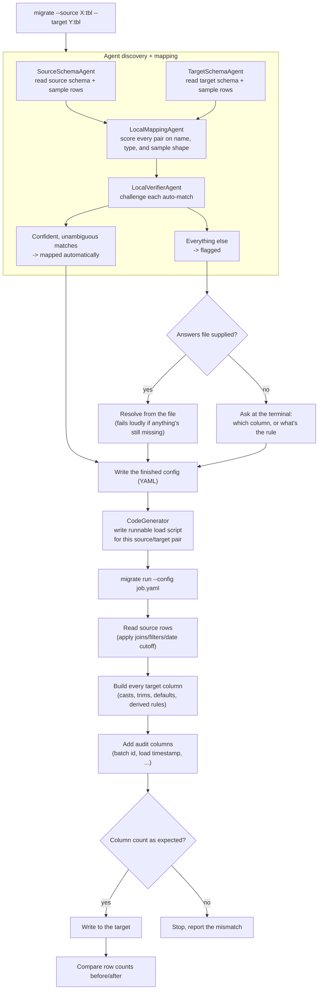

# migration-framework

A tool-agnostic way to move data between two systems without hand-writing a
new script every time. Point it at a source table and a target table; an
agent workflow reads both schemas, proposes and cross-checks the column
mapping, asks you only about the columns it can't confidently resolve,
writes a runnable load script for that specific source/target pair, and
runs (and re-runs) the load from the config that comes out the other end.

Nothing here is specific to one database. One connector speaks to anything
SQLAlchemy has a dialect for - Postgres, MySQL, SQLite, Snowflake, Databricks,
BigQuery, Oracle, SQL Server - so "any migration" really means any pair of
systems you point it at, not just the one this was originally built around
(a Databricks PO-header table being loaded into Snowflake).

## Why this exists

The starting point was a working PySpark script that loaded a Databricks
table into Snowflake. It worked, but every new region or table meant copying
the whole script and hand-editing the column list - the slowest, most
error-prone part of the job. This framework replaces that by:

1. Reading the actual columns, types, and a sample of real rows from both
   sides, instead of a person reading a schema doc.
2. Running an agent workflow (`SourceSchemaAgent`, `TargetSchemaAgent`,
   `LocalMappingAgent`, `LocalVerifierAgent`) that proposes and challenges
   the mapping using name similarity, type compatibility, and what the sample
   data actually looks like - all in code, no AI service required to run it.
3. Only asking a person about what's left over: columns with no confident
   match, or a business rule that isn't a straight copy (there's no column
   in the source that means "is this cancelled" - that has to be defined,
   not matched).
4. Running the same way every time after that, from a plain config file,
   from whatever already schedules your jobs.

## Install

```bash
python -m venv .venv && source .venv/bin/activate
pip install -e ".[dev]"
```

This installs the `migrate` command plus SQLAlchemy and PyYAML - the whole
runtime dependency list. Nothing here calls out to any AI service; the
default agents are deterministic local reasoning and run fully offline.

## Quickstart

Two throwaway SQLite databases stand in for "the legacy system" and "the new
one", with column names that don't match on purpose:

```bash
python examples/setup_demo_db.py
```

`legacy_orders` (source): `ORDER_ID, ORDER_DT, CUST_NUM, AMT, STATUS_CD`
`orders_fact` (target): `order_id, order_date, customer_number, amount, is_cancelled, batch_id, etl_load_ts`

Discover the mapping. The skill-style shorthand is usually enough:

```bash
migrate \
  --source sqlalchemy:legacy_orders --source-connection '{"connection_url": "sqlite:///examples/source.db"}' \
  --target sqlalchemy:orders_fact --target-connection '{"connection_url": "sqlite:///examples/target.db"}' \
  --job-name orders_demo --out examples/orders_demo.yaml \
  --audit-columns batch_id,etl_load_ts
```

The long form also works:

```bash
migrate discover \
  --source-connector sqlalchemy --source-connection '{"connection_url": "sqlite:///examples/source.db"}' --source-table legacy_orders \
  --target-connector sqlalchemy --target-connection '{"connection_url": "sqlite:///examples/target.db"}' --target-table orders_fact \
  --job-name orders_demo --out examples/orders_demo.yaml \
  --audit-columns batch_id,etl_load_ts
```

This prints something like:

```text
4/5 columns auto-mapped.
  flagged: is_cancelled (no confident match)
```

`order_id`, `order_date`, `customer_number`, and `amount` matched
confidently on their own (name + type + a look at the sample values -
`ORDER_DT`'s values are date-shaped strings, so it's correctly matched to
the date-typed `order_date`, even though the names aren't identical).
`is_cancelled` has no source column to copy - it's a rule, not a
mapping - so it drops into an interactive prompt:

```text
  is_cancelled (string) — no confident match
    [1] STATUS_CD   (confidence 55%)
    [d] derived / business-rule column (no source copy)
    [s] skip - leave this column null
    or type the exact source column name
  >
```

Typing `d` and then `STATUS_CD == 'X' -> Y` (blank line, then `N` for
"otherwise") records that rule. To skip the prompt entirely - useful in CI,
or to answer the same question every time a schema is rediscovered - answer
it upfront in a file instead:

```yaml
# examples/answers.yaml
is_cancelled:
  derived:
    when:
      - condition: "STATUS_CD == 'X'"
        then: "Y"
    otherwise: "N"
```

```bash
migrate discover ... --answers examples/answers.yaml
```

Either way, `discover` writes two artifacts: a plain config file and a
runnable load script for the source/target pair (SQL, PySpark, or Snowpark,
chosen from the target connector). Run it:

```bash
migrate run --config examples/orders_demo.yaml --dry-run   # check first, writes nothing
migrate run --config examples/orders_demo.yaml             # run it for real
```

```text
wrote 3 rows to orders_fact (0 -> 3)
reconciled: True
```

Run `migrate run` again later and it does the same thing again, with no
Python to edit - a new source/target pair is a new `discover` call, not a
new script.

## How it fits together



## What's actually in the package

| Module | Responsibility |
| --- | --- |
| `connectors/base.py` | The `Connector` interface - `get_schema`, `read_rows`, `write_rows`, `row_count`. Anything that implements these four can be a source or a target. |
| `connectors/sqlalchemy_connector.py` | One connector covering any SQLAlchemy-dialect database. This is what makes "any migration" true today without writing per-database code. |
| `connectors/dbapi_connector.py` | Native connectors for Snowflake (`snowflake-connector-python`) and Databricks (`databricks-sql-connector`). Install with `pip install migration-framework[snowflake]` or `[databricks]`. |
| `connectors/pyspark_connector.py` | Native PySpark connector for Spark/Delta tables. Install with `pip install migration-framework[pyspark]`. |
| `registry.py` | Maps a `connector: <name>` string in config to a connector class. Add a new system by registering one class here. |
| `agents/` | Agent-based discovery and mapping. `DiscoveryWorkflow` orchestrates `SourceSchemaAgent`, `TargetSchemaAgent`, `LocalMappingAgent`, and `LocalVerifierAgent`. |
| `agents/mapping_agent.py` | `LocalMappingAgent` scores every (source column, target column) pair on name similarity, type compatibility, and sample-data shape; greedily assigns confident, unambiguous matches; flags the rest. Pure local reasoning, no external service. |
| `agents/verifier_agent.py` | `LocalVerifierAgent` challenges each auto-accepted mapping - weak shape, ambiguous generic source names, or a better name match elsewhere. |
| `codegen/` | Per-pair load-script generation. `SQLGenerator`, `PySparkGenerator`, `SnowparkGenerator`, and a registry that picks the right one from the target connector. |
| `skills/` | Reusable, tool-agnostic skills and workflows. `Skill` interface, `Workflow` composer, and built-in skills (`read-source`, `read-target`, `map`, `verify`, `discover`, `codegen`, `build-config`, `map-verify-codegen`). |
| `conditions.py` | A small, safe expression parser for derived-column rules (`col in ('a','b')`, `col == 'x'`, `col is null`, ...) - parsed by hand, never `eval()`. |
| `hitl.py` | Turns flagged columns into either a terminal prompt or a lookup against a pre-supplied answers file. Both paths produce the same `ColumnMapping` list. |
| `config.py` | The `MigrationConfig` shape and its YAML load/save - what `discover` produces and `run` consumes. |
| `engine.py` | Runs an actual migration from a finished config: joins/filters, casts/defaults/derived rules, audit columns, validation, the write, and row-count reconciliation. |
| `cli.py` | `migrate --source X:tbl --target Y:tbl`, `migrate discover`, `migrate run`, `migrate skill`, and `migrate workflow` - the one interface any orchestrator calls. |
| `mcp_server.py` | `migrate-mcp` MCP server exposing skills/workflows as tools for Claude, Cursor, and other MCP hosts. |

## Databricks and Snowflake

The framework now ships native connectors and per-pair codegen for Databricks
and Snowflake, covering every source/target combination:

- **Same warehouse:** `snowflake -> snowflake` emits Snowpark, `databricks -> databricks` emits PySpark/Delta, `sqlalchemy -> sqlalchemy` emits SQL.
- **Cross warehouse:** any other pair emits a Python engine script that uses the migration framework's connectors to read from the source and write to the target (e.g. `databricks -> snowflake`, `snowflake -> sql`, etc.).
- **Medallion layers:** use qualified table names like `bronze.orders`, `silver.orders`, `gold.orders` or `catalog.schema.table` directly.

Install the native drivers:

```bash
pip install "migration-framework[snowflake,databricks]"
```

Discover and generate a Snowpark load:

```bash
migrate --source snowflake:bronze.orders \
  --target snowflake:silver.orders \
  --source-connection '{"account":"...","user":"...","password":"...","database":"...","schema":"..."}' \
  --target-connection '{"account":"...","user":"...","password":"...","database":"...","schema":"..."}' \
  --job-name orders_demo --out orders_demo.yaml
```

## MCP server

The package also exposes the framework as an MCP server:

```bash
pip install "migration-framework[mcp]"
migrate-mcp
```

Tools include `discover`, `run_skill`, `run_workflow`, `migrate`, `list_skills`,
and `list_connectors`.  See `mcp_configs/claude_desktop_config.json.example` for
a sample Claude Desktop configuration that wires the migration-framework server
together with Databricks and Snowflake MCP servers.

## Reusable skills and workflows

Every step of the migration pipeline is also exposed as a standalone, tool-agnostic
`Skill`.  Skills accept a `SkillContext` (a JSON-serializable bag of inputs) and
return a `SkillResult` (outputs + reasoning + success/error).  Workflows compose
skills into reusable sequences with optional conditions and retries.

List everything you can call directly:

```bash
migrate skill --list
migrate workflow --list
```

Run a single skill:

```bash
migrate skill discover \
  --inputs '{
    "source_connector": "sqlalchemy",
    "source_connection": {"connection_url": "sqlite:///examples/source.db"},
    "source_table": "legacy_orders",
    "target_connector": "sqlalchemy",
    "target_connection": {"connection_url": "sqlite:///examples/target.db"},
    "target_table": "orders_fact"
  }'
```

Run the built-in end-to-end workflow:

```bash
migrate workflow map-verify-codegen \
  --inputs '{
    "source_connector": "sqlalchemy",
    "source_connection": {"connection_url": "sqlite:///examples/source.db"},
    "source_table": "legacy_orders",
    "target_connector": "sqlalchemy",
    "target_connection": {"connection_url": "sqlite:///examples/target.db"},
    "target_table": "orders_fact",
    "job_name": "orders_demo",
    "audit_columns": "batch_id,etl_load_ts"
  }'
```

Skills and workflows are not tied to any database.  You can also call them from
Python:

```python
from migration_framework.skills import get_skill, SkillContext

skill = get_skill("codegen")
result = skill().run(SkillContext(inputs={"config": "orders_demo.yaml"}))
print(result.outputs["generated"]["path"])
```

## Config reference

```yaml
job_name: orders_demo

source:
  connector: sqlalchemy
  connection: { connection_url: "postgresql://.../legacydb" }
  table: legacy_orders
  date_cutoff: { column: ORDER_DT, on_or_after: "2022-01-01" }
  joins:                      # optional - reproduces "keep rows that match a lookup filter"
    - alias: dtl
      table: dw_po_dtl
      join_on: { left: PO_HDR_SNUM, right: PO_HDR_SNUM }
      mode: semi              # "semi": filter source rows only. "enrich": merge the joined columns in.
      filter:
        column: BANNER_GEO
        equals: APAC
        via_table: dim_location_t          # optional second hop, when the filter column
        via_join_on: { left: STR_SNUM, right: LOC_NUM }  # lives on a different table than the join

target:
  connector: sqlalchemy
  connection: { connection_url: "snowflake://..." }
  table: orders_fact
  mode: append                 # or "overwrite"
  pre_actions: "USE DATABASE ..."   # optional, run once before the write

columns:
  - target: order_id
    source: ORDER_ID
    trim: true
  - target: order_date
    source: ORDER_DT
    cast: date                 # int | float | date | timestamp | bool | string
    default: "1900-01-01"
  - target: is_cancelled
    derived:
      when:
        - condition: "STATUS_CD == 'X'"
          then: "Y"
      otherwise: "N"

audit_columns:
  - name: batch_id
    generator: batch_id        # today's date as YYYYMMDD
  - name: etl_load_ts
    generator: now              # this run's timestamp
  - name: src_load_ts
    generator: null              # always null

validation:
  expected_column_count: 7
  reconcile_row_count: true
```

## Extending it

**A new skill or workflow:** subclass `Skill` in `skills/base.py` and apply
`@register_skill`, or compose existing skills with `Workflow` and
`WorkflowStep`.  Skills are tool-agnostic: they receive a `SkillContext` and
return a `SkillResult`.  The existing `read-source`, `map`, `verify`,
`discover`, `codegen`, and `build-config` skills are thin wrappers around the
agents and generators, so a new skill can reuse the same primitives.

**A smarter mapper or verifier:** the `agents/` package uses the same
`MappingProposal` shape as `mapper.propose_mapping`, so an LLM-backed
`MappingAgent` or `VerifierAgent` can drop in alongside the local agents.
`DiscoveryWorkflow` accepts custom agents in its constructor; everything
downstream (`hitl`, `config`, `engine`, `codegen`) stays the same.

**A new target engine:** register a `CodeGenerator` subclass in
`codegen/registry.py` and `discover` will emit a load script for that engine.
SQL is the fallback for any engine without a dedicated generator.

**A new database or warehouse as source/target:** if it has a SQLAlchemy
dialect (most do), nothing else to write. If it doesn't, implement `Connector`
in `connectors/base.py` and register it in `registry.py`.

**A different HITL surface:** `hitl.resolve_with_answers` takes a plain
dict, so a web form, a Slack message, or a review queue can all produce the
same input a YAML answers file does - `resolve_interactive`'s terminal
prompt is just the simplest option, not the only one.

## Tests

```bash
pytest
```

Covers the condition parser, the mapping and verifier agents (including the
case built directly from the original script: generically numbered source
columns that must be flagged, never guessed), code generation for SQL,
PySpark, and Snowpark targets, CLI shorthand parsing, the reusable `Skill`
and `Workflow` layer, skill/workflow CLI commands, config round-tripping,
and end-to-end runs against real SQLite databases - one plain load and one
reproducing the original region lookup-join-filter.
